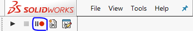

# Solidworks Macro Tutorial
In this tutorial, I will show the process of how to make an .exe file using VB.net.

Because there is little information on the internet. So I decided to write one.

Many other tutorials have tought the way to record a macro, and run the macro on Solidworks. However, this is not enough.

Someone like me want to use an .exe file, so that I can call the macro directly by command window, instead of Solidworks.

---
## Software I used:
* Solidworks 2017
* Visual Studio 2013
I think the sortware version does'nt matter.

---
## Tutorial starts by here:

### Start Solidworks:
The first step is click the start macro button, then you can record everything you need.

In my case, I draw a cuboid.

Finally, click the stop button.

After recording a macro, you should save it as 
`SW ALL Macros Types (*.swp;*.csproj;*.vbproj)`

a .swp file, a vb.net folder, a csharp folder will be createrd.

### Start Visual Studio:
start Visual Studio, and  add a new Visual Basic project. Just like the figure shown below.

(Sorry that I don't have an English version)

