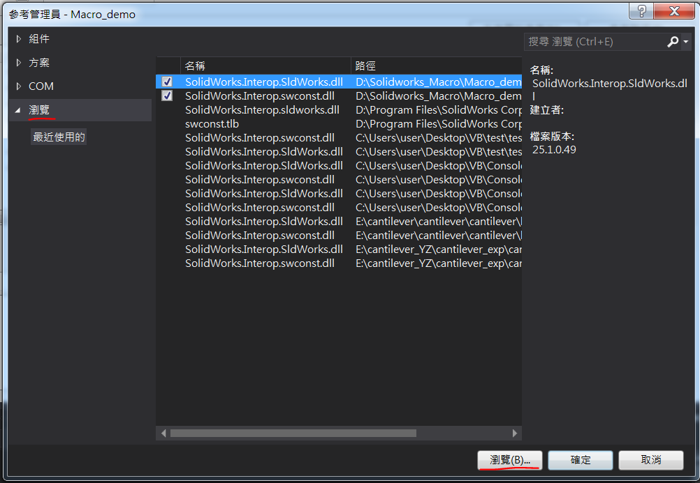
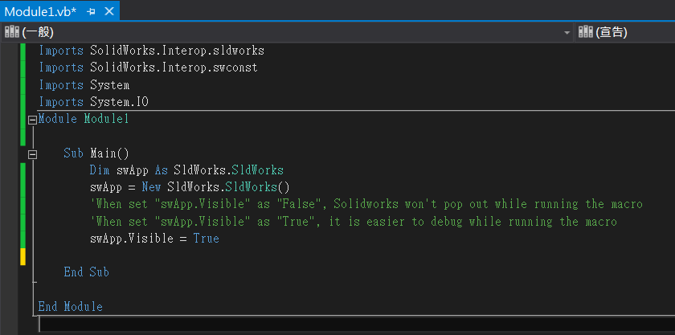

# Solidworks Macro Tutorial
In this tutorial, I will show the process of how to make an .exe file using VB.net.

Because there is little information on the internet. So I decided to write one.

Many other tutorials have tought the way to record a macro, and run the macro on Solidworks. However, this is not enough.

Someone like me want to use an .exe file, so that I can call the macro directly by command window, instead of Solidworks.


---
## Software I used:
* Solidworks 2017
* Visual Studio 2013
I think the sortware version does'nt matter.

---
## Tutorial starts by here:

### Start Solidworks:
The first step is click the start macro button, then you can record everything you need.


In my case, I draw a cuboid.


Finally, click the stop button.


After recording a macro, you should save it as 
`SW ALL Macros Types (*.swp;*.csproj;*.vbproj)`


a .swp file, a vb.net folder, a csharp folder will be createrd.


### Start Visual Studio:
Start Visual Studio, and  add a new Visual Basic project. Just like the figure shown below.

(Sorry that I don't have an English version)


So I created a VB project called "Macro_demo". 

And see the file "Module1.vb" with 4 lines.


Before doing anything, we must do the following steps in order to successfully run the project.

You must puts two files in the project folder. 
In my case  it is: `D:\Solidworks_Macro\Macro_demo\Macro_demo\bin\Debug`
### Two files:
* SolidWorks.Interop.SldWorks.dll 
* SolidWorks.Interop.swconst.dll

Actually, I forgot where did I get these files. Perhaps on the internet. So if you don't have those file you can use mine.

Go to project -> properties -> reference path 

### Click "add"


---
### Go to browse, and select the two files:
* SolidWorks.Interop.SldWorks.dll 
* SolidWorks.Interop.swconst.dll


---
### Go to "COM", and select two libraries:
* SldWorks 2017 Type Library
* SOLIDWORKS2017 Constant type library


---
As a result, we added 4 things. Like the figure shown below.


---
Let's go back to the file "Module1.vb", and do the rest of the things.

We have to put the following lines into the file.
```vbnet
Imports SolidWorks.Interop.sldworks
Imports SolidWorks.Interop.swconst
Imports System
Imports System.IO
```

```vbnet
Dim swApp As SldWorks.SldWorks
swApp = New SldWorks.SldWorks()
'When set "swApp.Visible" as "False", Solidworks won't pop out while running the macro
'When set "swApp.Visible" as "True", it is easier to debug while running the macro
swApp.Visible = True
```

And the file becomes:


===
Go to the Macros we recorded at the beginning.

Inside the folder `Macro1-vbnet`.

In my case, open the file, `SolidWorksMacro.vb`, inside `D:\Solidworks_Macro\Macro1-vbnet\SwMacro`.

Copy the codes between `Public Sub main()` and `End Sub`


